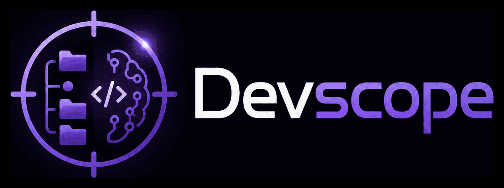

<p align="center">
  
</p>

<p align="center">
  Yerel git depolarınızı tarayan, yapay zekâ destekli kişisel geliştirici üretkenlik aracı.<br/>
  Tüm verileriniz makinenizde kalır — hiçbir kod veya commit içeriği üçüncü taraf bir sunucuya gönderilmez
  <em>(kendinizin yapılandırdığı LLM çağrıları hariç)</em>.
</p>

<p align="center">
  <a href="../../releases/latest"></a>
  <a href="LICENSE"></a>
  
</p>

---

Ne yapar?
- Kayıtlı projelerinizin son N saatlik commit aktivitesinden **standup tarzı özetler** üretir.
- Çalışmamış dosyalardan akıllı **commit mesajları** önerir.
- Günlük katkı ısı haritası, proje istatistikleri ve geçmiş raporlar için bir **web panosu** sunar.
- Tek bir **masaüstü uygulaması** (Tauri) olarak çalışır — sunucu / kurulum gerekmez.

---

## 🚀 İndir ve çalıştır (önerilen)

Hiçbir şey kurmanıza gerek yok. İşletim sisteminize göre installer'ı [Releases](../../releases/latest) sayfasından indirin ve çift tıklayın:

| İşletim sistemi    | Dosya                                |
|--------------------|--------------------------------------|
| macOS (Apple Silicon) | `devscope_x.y.z_aarch64.dmg`       |
| macOS (Intel)      | `devscope_x.y.z_x64.dmg`             |
| Windows 10/11      | `devscope_x.y.z_x64-setup.exe` veya `.msi` |
| Linux (Debian/Ubuntu) | `devscope_x.y.z_amd64.deb`        |
| Linux (universal)  | `devscope_x.y.z_amd64.AppImage`      |

Açtığınızda devscope açılır. Yapılması gerekenler:

1. **Settings** sekmesinden bir LLM sağlayıcısı seçin:
   - **OpenAI** kullanmak istiyorsanız → API anahtarınızı (`sk-…`) yapıştırın.
   - **Yerel / ücretsiz** istiyorsanız → [Ollama](https://ollama.com/download)'yı kurun, ardından bir model çekin: `ollama pull llama3.1:8b`.
2. **Projects** sekmesinden bir veya birkaç git deposunun yolunu ekleyin (`~/code/my-app` gibi).
3. **Dashboard** sekmesinde "Run today's summary"e basın — son 24 saatin özetini görürsünüz.

> Notlar — kod imzalı değiliz (Apple Developer / Authenticode yok):
>
> **macOS:** İlk açılışta splash ekranında *"Backend couldn't start: backend not reachable…"* görürseniz, sebep macOS Gatekeeper'ın DMG'den kopyalanan içindeki imzasız Python sidecar binary'lerine `com.apple.quarantine` xattr'ı eklemesi. Tek seferlik çözüm — Terminal'de:
> ```bash
> xattr -dr com.apple.quarantine /Applications/devscope.app
> ```
> Uygulamayı kapatıp tekrar açın. Sonraki başlatmalarda sormaz.
>
> **Windows:** SmartScreen "Daha fazla bilgi" → "Yine de çalıştır".

İlk sürüm henüz yayımlanmamışsa [Kaynaktan kurulum (geliştiriciler)](#kaynaktan-kurulum-geliştiriciler) bölümüne bakın.

---

## İçindekiler

1. [Çalışma şekli](#çalışma-şekli)
2. [LLM sağlayıcıları (OpenAI veya Ollama)](#llm-sağlayıcıları)
3. [Verilerin nerede tutulduğu](#verilerin-nerede-tutulduğu)
4. [Sorun giderme](#sorun-giderme)
5. [Kaynaktan kurulum (geliştiriciler)](#kaynaktan-kurulum-geliştiriciler)
6. [CLI kullanımı](#cli-kullanımı)
7. [Yapılandırma](#yapılandırma)
8. [Sürüm yayımlama (maintainer)](#sürüm-yayımlama-maintainer)
9. [Lisans](#lisans)

## Çalışma şekli

```
   ┌─────────────────┐     ┌──────────────────┐     ┌────────────────┐
   │ Yerel git repo  │ ──▶ │  devscope        │ ──▶ │ LLM sağlayıcı  │
   │ (pygit2 ile     │     │  (Tauri uygulama │     │ OpenAI / Ollama│
   │ okunur)         │     │   + FastAPI)     │     └────────────────┘
   └─────────────────┘     └──────────────────┘             │
                                   │                        ▼
                                   ▼               ┌────────────────┐
                          ┌────────────────┐       │ Standup özeti  │
                          │ ~/.devscope/   │       │ commit mesajı  │
                          │   devscope.db  │       └────────────────┘
                          └────────────────┘
```

Masaüstü uygulaması açıldığında küçük bir Python backend'i (FastAPI) yerel `127.0.0.1` üzerinde başlatır. Veriler kullanıcının kişisel veri klasöründeki SQLite veritabanında tutulur.

## LLM sağlayıcıları

`--provider auto` (varsayılan) önce OpenAI anahtarına bakar, bulamazsa Ollama'ya düşer.

**Ollama (ücretsiz, internet gerekmez):**

```bash
# macOS
brew install ollama
ollama serve &
ollama pull llama3.1:8b
```

**OpenAI (daha kaliteli, ücretli):**

Settings sekmesinde anahtarınızı (`sk-...`) yapıştırmanız yeterlidir. CLI tercih ediyorsanız `export OPENAI_API_KEY=sk-...`.

Bütçe koruyucusu (`llm.budget.hard_stop = true` iken) aylık limit aşıldığında çağrıları reddeder; tahmini maliyet her çağrıdan sonra veritabanına yazılır.

## Verilerin nerede tutulduğu

Tüm devscope durumu tek bir klasördedir:

```
~/.devscope/
├── config.toml     # TOML yapılandırması (yoksa varsayılan kullanılır)
├── devscope.db     # SQLite (projeler, eventler, raporlar, LLM çağrı kayıtları)
└── secrets.json    # API anahtarları (chmod 600)
```

Bu klasörü silmek devscope'un hatırladığı her şeyi silmek demektir. **Kayıtlı git depoları içindeki kodunuza dokunulmaz.**

Klasörü taşımak isterseniz `DEVSCOPE_HOME` ortam değişkenini ayarlayın.

## Sorun giderme

| Sorun                                                          | Çözüm                                                                          |
|----------------------------------------------------------------|--------------------------------------------------------------------------------|
| macOS: "Backend couldn't start: backend not reachable…"        | `xattr -dr com.apple.quarantine /Applications/devscope.app` (imzasız sidecar quarantine'ı). |
| macOS: "devscope bozuk / açılamaz"                             | Finder'da sağ tık → Open → Open. Apple imzalı değil; manuel onay yeterli.       |
| Windows SmartScreen uyarısı                                    | "Daha fazla bilgi" → "Yine de çalıştır".                                       |
| Linux'ta AppImage çalışmıyor                                   | `chmod +x devscope*.AppImage && ./devscope*.AppImage`.                          |
| "OpenAI key required"                                          | Settings sekmesinden `OPENAI_API_KEY` girin ya da ortamda dışa aktarın.        |
| Ollama: `connection refused`                                   | `ollama serve` çalışıyor mu kontrol edin (`curl localhost:11434`).              |
| "is not a git repository"                                      | Eklediğiniz yol bir `.git` dizini içermeli. Bare repo'lar şu an desteklenmez.   |
| Bütçe nedeniyle özet üretilmiyor                               | `~/.devscope/config.toml` → `[llm.budget]` altında `monthly_usd`'yi artırın.    |

---

## Kaynaktan kurulum (geliştiriciler)

Yalnızca: yeni özellik eklemek isteyenler, henüz binary bulunmayan platformlar veya katkı sağlayanlar için.

### Gereksinimler

- Python ≥ 3.11
- [`uv`](https://docs.astral.sh/uv/) (önerilen) veya `pipx` / `pip`
- Node.js ≥ 20 + `pnpm`
- Rust ≥ 1.77 (`rustup`)
- Platforma özgü Tauri ön koşulları → [tauri.app/start/prerequisites](https://tauri.app/start/prerequisites/)

### Geliştirme modunda çalıştırma

```bash
git clone https://github.com/<sizin-hesap>/devscope.git
cd devscope

# 1) Python ortamı
uv sync --extra dev
source .venv/bin/activate

# 2) Frontend bağımlılıkları
cd frontend && pnpm install && cd ..

# 3) Sidecar backend'i bir kez derle (PyInstaller bundle)
./scripts/build_backend.sh

# 4) Tauri uygulamasını dev modunda aç
cd src-tauri
cargo tauri dev
```

### Yerel installer üretmek

```bash
# Backend bundle'ı taze tutun
./scripts/build_backend.sh

# Tauri release derlemesi — DMG / EXE / DEB / AppImage çıktısı
cd src-tauri
cargo tauri build
# → src-tauri/target/release/bundle/ altında platforma uygun dosya
```

Üretilen dosyayı arkadaşınıza vermek, "indir-çalıştır" deneyiminin yerel karşılığıdır.

## CLI kullanımı

Tauri'siz, sadece terminal:

```bash
pipx install -e .       # ya da: uv tool install -e .

devscope init                              # ~/.devscope ve veritabanı
devscope projects add ~/code/my-app -n my  # bir repo'yu kaydet
devscope projects list
devscope today                              # son 24 saatin standup'ı
devscope today --since-hours 48 --project my
devscope serve                              # http://127.0.0.1:8765
```

Hangi sağlayıcı kullanılacağını seçin:

```bash
devscope today --provider openai      # OPENAI_API_KEY gerekli
devscope today --provider ollama      # yerel ollama daemon
```

## Yapılandırma

`~/.devscope/config.toml` (yoksa varsayılanlar uygulanır):

```toml
[llm]
provider_chain = ["ollama"]

[llm.default_model]
ollama = "llama3.1:8b"
openai = "gpt-4o-mini"

[llm.budget]
monthly_usd = 20.0
hard_stop   = true

[scanner]
auto_rescan_days   = 30
max_discover_depth = 4

[web]
host = "127.0.0.1"
port = 8765
shared_secret = ""    # boş = yerel-yalnız
```

Çevre değişkenleri:

| Değişken            | Anlamı                                                  |
|---------------------|---------------------------------------------------------|
| `DEVSCOPE_HOME`     | Veri klasörünün yerini değiştirir (varsayılan `~/.devscope`) |
| `OPENAI_API_KEY`    | OpenAI sağlayıcısını etkinleştirir                       |

## Sürüm yayımlama (maintainer)

Repo'da `.github/workflows/release.yml` mevcut. Yeni sürüm çıkarmak için tek yapmanız gereken:

```bash
git tag v0.1.0
git push origin v0.1.0
```

Bu tag'i ittiğinizde GitHub Actions:

1. macOS arm64, macOS x64, Windows x64 ve Linux x64 runner'larında paralel build başlatır.
2. Her platformda frontend'i derler, Python backend'ini PyInstaller ile bundle'lar, Tauri'yi paketler.
3. Tüm artefaktları **taslak (draft) bir GitHub Release**'e ekler.

Release sayfasında dosyaları gözden geçirin, açıklama yazın ve **Publish** butonuna basın. Bu noktada Releases sayfası kullanıcı için hazır.

Tag'i yanlış attıysanız:

```bash
git push --delete origin v0.1.0
git tag -d v0.1.0
```

## Repo yapısı

```
src/devscope/        Python paketi (CLI + FastAPI uygulaması)
  cli/               Typer komutları
  collectors/        pygit2 ile yerel git okuma
  generators/        Standup ve commit-mesaj prompt'ları
  llm/               OpenAI / Ollama sağlayıcıları, bütçe ve yönlendirme
  storage/           SQLAlchemy modelleri ve repository'ler
  web/               FastAPI uygulaması (/api/*)
frontend/            React + Vite SPA
src-tauri/           Tauri 2 kabuğu (Rust)
migrations/          Alembic şema göçleri
scripts/             build_backend.sh — PyInstaller sidecar üretici
tests/               pytest paketleri
.github/workflows/   ci.yml (test) + release.yml (otomatik build)
```

## Lisans

[MIT](LICENSE) © 2026 Ceyhun Emre
